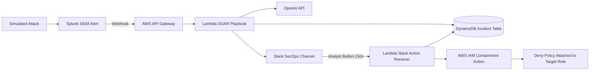

# AegisSOAR: Event-Driven Cloud Security Playbook

## Overview

AegisSOAR is a serverless Security Orchestration, Automation, and Response lab that demonstrates how cloud alerts can be converted into analyst-reviewed containment actions. It addresses a common SOC automation problem: fully automated remediation can be risky, but manual response can be slow when a cloud identity or workload appears compromised.

The project receives alert telemetry from Splunk, routes it through AWS API Gateway and Lambda, stores incident state in DynamoDB, generates a short AI-assisted threat narrative, and sends an interactive Slack message for human approval. If the analyst approves containment, a second Lambda function updates the incident state and attaches a deny policy to the target IAM role.

The final system demonstrates a human-in-the-loop SOAR workflow with state tracking, AI-assisted summarization, Slack interaction, and AWS IAM containment logic. It is a lab implementation, not a production SOAR platform.

## Key Features

- Built an event-driven incident receiver with AWS API Gateway and Lambda.
- Stored incident state in DynamoDB.
- Generated AI-assisted SOC narratives from alert fields.
- Sent interactive Slack Block Kit messages to a security operations channel.
- Added human approval before executing containment.
- Updated Slack messages after approval or false-positive selection.
- Executed AWS IAM containment by attaching a deny policy to a target role.
- Provisioned the serverless stack with Terraform.
- Included Kubernetes quarantine policy notes and screenshot evidence.

## Architecture

Splunk sends alert telemetry to an AWS API Gateway endpoint. Lambda parses the alert, writes an incident record to DynamoDB, generates an AI narrative, and posts an interactive Slack alert. A human analyst chooses whether to approve quarantine or mark the event as a false positive. Slack sends the button action to a second Lambda receiver, which updates DynamoDB and performs the approved containment action.

## Tools & Technologies

### Cloud / Infrastructure

- AWS API Gateway
- AWS Lambda
- Amazon DynamoDB
- AWS IAM
- Terraform

### Security Tools

- Splunk webhook alerting
- SOAR-style containment workflow
- Slack Block Kit for analyst approval
- IAM deny policy containment

### Programming / Scripting

- Python 3.10
- Boto3
- Terraform HCL
- JSON alert parsing

### Monitoring / Logging

- Incident records in DynamoDB
- Slack alert messages
- Lambda execution logs
- Screenshot-based validation

### Automation / CI/CD

- Terraform-managed deployment
- No CI/CD pipeline is included in this repository

## Security Concepts Demonstrated

This project demonstrates SOAR design, incident state management, human-in-the-loop remediation, cloud containment, IAM response actions, AI-assisted alert summarization, and secure automation tradeoffs.

The human approval step is an important design decision. Instead of immediately applying a disruptive containment action, the system pauses for analyst review, then records the final state as either contained or false positive.

The project also demonstrates how cloud response automation needs narrow permissions, state tracking, auditability, and rollback planning before it can be considered production-ready.

## Implementation Steps

1. Defined a mock Splunk alert payload with fields such as alert name, attacker IP, host, and IAM role.
2. Built a Lambda playbook to parse the alert and create an incident ID.
3. Added DynamoDB storage for incident state.
4. Added AI-assisted narrative generation for analyst context.
5. Sent a Slack Block Kit message with approve and false-positive actions.
6. Built a Slack action receiver Lambda for button callbacks.
7. Updated DynamoDB state based on analyst action.
8. Added IAM containment logic to attach a deny policy to the target role after approval.
9. Provisioned the API Gateway, Lambda functions, DynamoDB table, IAM policies, and function URL with Terraform.
10. Validated the workflow with local alert simulation and screenshots.

## Results / Findings

The project produced a working human-in-the-loop response flow. Screenshots show Terraform deployment, interactive Slack approval, and automated quarantine evidence. The lab demonstrates how a raw alert can become a tracked incident with an AI summary, analyst decision point, and cloud containment action.

The main finding is that response automation is most useful when it preserves analyst control for high-impact actions. The workflow can speed up triage and execution while still requiring a human decision before IAM permissions are changed.

## Evidence / Artifacts

Existing evidence in this repository:

- `docs/screenshots/human-in-the-loop-success.png`
- `docs/screenshots/interactive-slack-ui.png`
- `docs/screenshots/automated-pod-quarantine.png`
- `docs/screenshots/terraform-apply-success.png`
- `docs/incident-workflow.md`
- `lambda_soar/soar_playbook.py`
- `lambda_soar/slack_action_receiver.py`
- `terraform/main.tf`
- `k8s_quarantine/quarantine_policy.yaml`

## Challenges & Lessons Learned

- SOAR workflows need state tracking so analysts can see whether an incident is pending, contained, or closed as a false positive.
- Human approval reduces the risk of disruptive automated containment.
- Slack interactivity requires careful callback handling and fast response timing.
- IAM containment logic should be narrowly scoped before use outside a lab.
- AI summaries are useful for context, but raw alert fields and deterministic actions still need to remain visible.

## Relevance to Security Roles

This project maps to Security Engineer, Cloud Security Engineer, SOC Automation Engineer, Detection Engineer, and Incident Response roles. It demonstrates alert intake, workflow orchestration, cloud response automation, IAM containment, and analyst-centered response design.

It is also relevant to AI Security and SecOps roles because it uses an LLM to support analyst communication without allowing the model to directly decide containment.

## Future Improvements

- Scope IAM permissions to specific lab roles instead of broad containment permissions.
- Add request signing or authentication for public webhook endpoints.
- Add structured CloudWatch logging and metrics for each incident state transition.
- Add rollback logic to remove containment after review.
- Add tests for Slack callback parsing and incident state updates.
- Add Terraform variables and examples for safer deployment.
- Export a sample Splunk alert configuration.
- Add a full incident timeline report for one simulated event.
