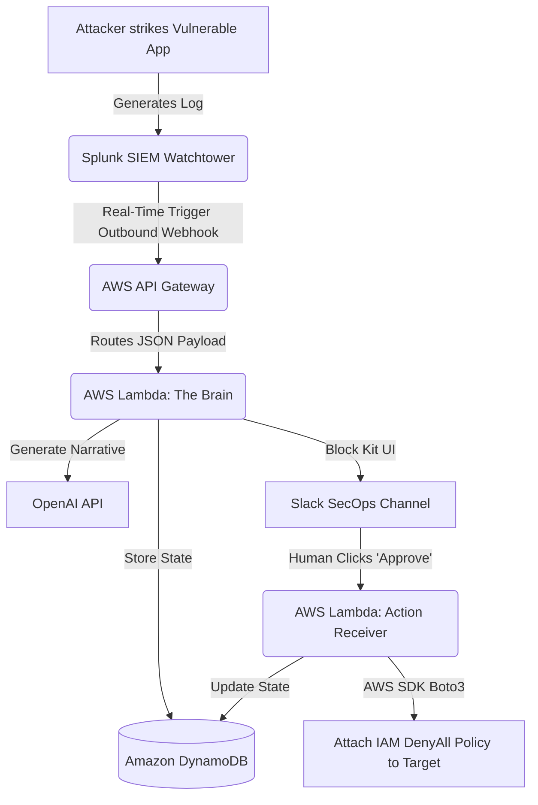
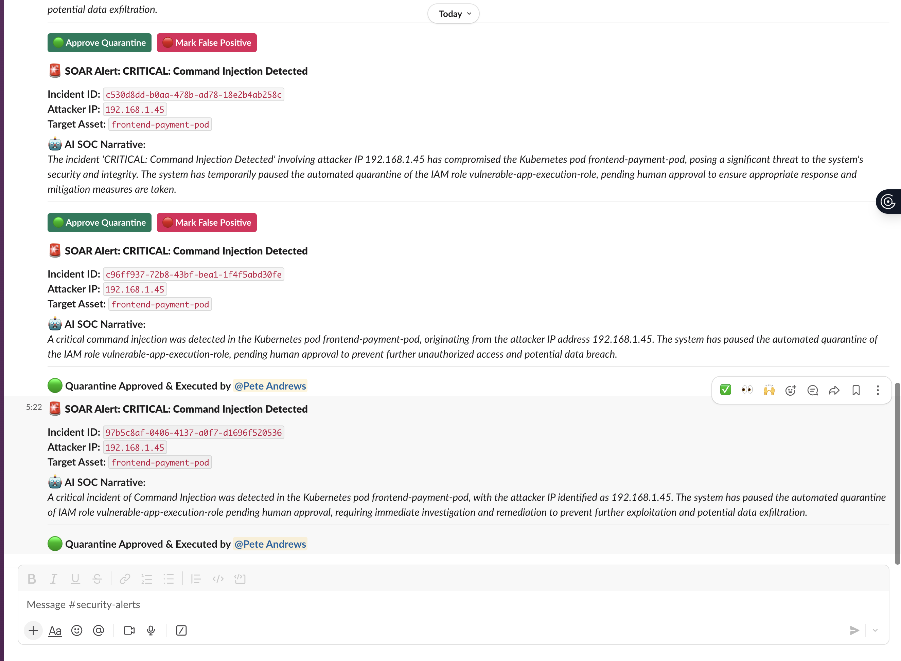

# AegisSOAR: Event-Driven Cloud Security Platform

An enterprise-grade, stateful Security Orchestration, Automation, and Response (SOAR) platform. This project intercepts real-time threat telemetry, utilizes an LLM to generate SOC threat narratives, and executes human-in-the-loop (HITL) cloud containment workflows via an interactive Slack UI.

## 🏗️ Architecture Flow



## 🚀 Core Features
* **Stateful Incident Management:** Leverages **Amazon DynamoDB** to track incident state (`PENDING_APPROVAL`, `CONTAINED_BY_HUMAN`, `FALSE_POSITIVE`) with millisecond latency.
* **AI SOC Analyst:** Integrates the OpenAI API directly into the Python remediation pipeline to instantly translate raw JSON alert telemetry into human-readable threat narratives.
* **Human-in-the-Loop (HITL) Workflows:** Uses **Slack Block Kit** and bi-directional webhooks to pause destructive cloud quarantine actions until a human analyst clicks an interactive approval button.
* **Automated Cloud Containment:** Executes dynamic AWS SDK (`boto3`) calls to instantly revoke compromised IAM role permissions, preventing lateral cloud movement across the AWS environment.
* **100% Infrastructure as Code (IaC):** Explicitly provisions the entire serverless architecture, NoSQL databases, API gateways, and strict Zero-Trust IAM roles via **Terraform**.

---

## 📸 Proof of Work & Validation

### 1. Human-in-the-Loop Slack UI & AI Narrative
When an attack is detected, AegisSOAR generates an AI summary and pushes an interactive approval block to the SecOps team. Once approved, the backend executes the cloud quarantine and dynamically updates the UI to reflect the successful containment.



### 2. Programmatic Cloud Deployment via IaC
The serverless endpoints, Lambda execution triggers, and customized remediation roles are programmatically mapped and deployed using reusable HCL templates.


---

## 🛠️ Repository Directory Tree

```text
aws-automated-soar-playbook/
├── terraform/
│   ├── main.tf                 # Core API Gateway, Lambda, DynamoDB, and IAM resource blocks
│   ├── providers.tf            # HashiCorp provider mapping configuration
│   └── terraform.tfvars        # (Git-Ignored) Local secrets for Slack/OpenAI injection
├── lambda_soar/
│   ├── soar_playbook.py        # Python 3.10 core detection, AI processing, and Slack formatting
│   ├── slack_receiver.py       # Python 3.10 callback receiver for HITL button execution
│   └── requirements.txt        # Package configuration dependencies (boto3, urllib)
├── docs/
│   └── screenshots/            # Portfolio proof validation images
└── README.md
```

## ⚙️ Local Threat Simulation Walkthrough

To validate the automation pipeline and trigger the Slack workflow without waiting for live external traffic, run the following flat mockup telemetry payload directly from your terminal workspace:

```bash
curl -d '{"search_name":"CRITICAL: Command Injection Detected","result":{"clientip":"192.168.1.45","host":"frontend-payment-pod","iam_role":"vulnerable-app-execution-role"}}' -H "Content-Type: application/json" https://<YOUR_API_GW_ID>[.execute-api.us-east-2.amazonaws.com/incident](https://.execute-api.us-east-2.amazonaws.com/incident)
```
