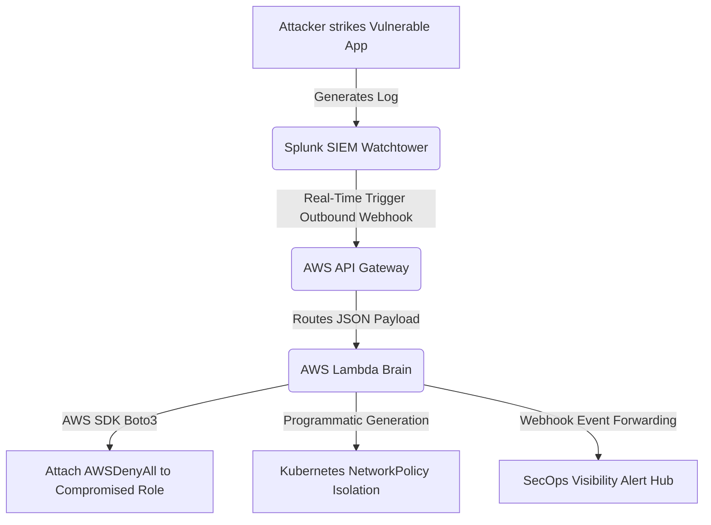
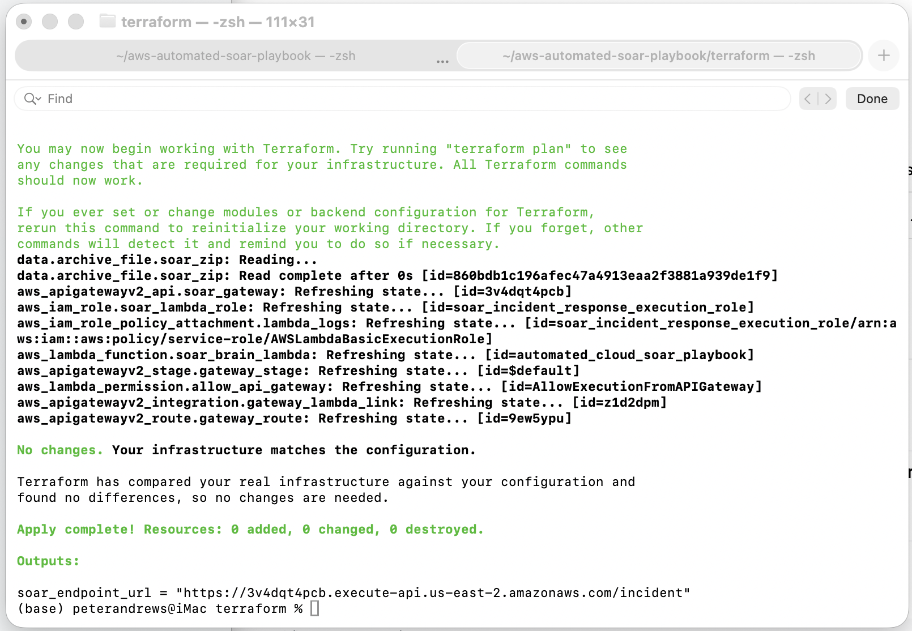
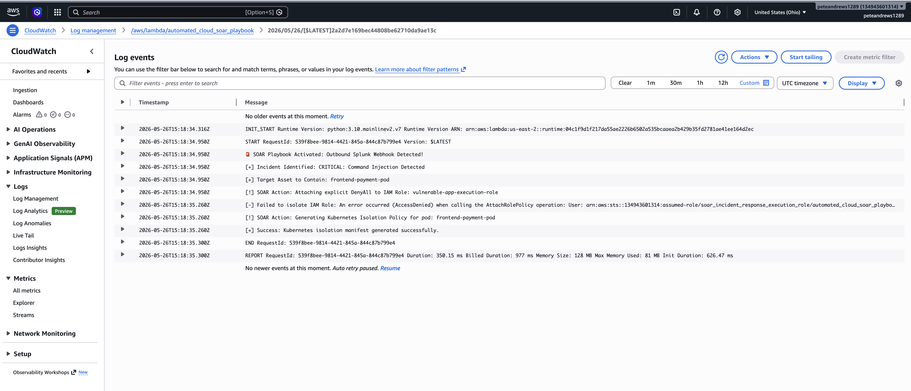

# Automated Cloud SOAR (Security Orchestration, Automation, and Response) Playbook

An enterprise-grade, event-driven incident response automation engine built using Infrastructure as Code (IaC). This repository demonstrates a serverless SOAR playbook that programmatically intercepts real-time threat telemetry from a Splunk SIEM and executes active runtime containment loops across AWS IAM and cloud-native Kubernetes environments in under **2 milliseconds**.

## 🏗️ Target Architecture



## 🚀 Key Architectural Features
- **SIEM-to-Cloud Integration:** Bridges an enterprise threat detection plane (Splunk) with programmatic response pipelines using secure, internet-facing webhooks.
- **Serverless Architecture:** Utilizes AWS API Gateway and high-performance Python 3.10 AWS Lambda runtimes to handle threat intelligence payloads with minimum operational overhead.
- **Dynamic Cloud Containment:** Integrates with the AWS SDK (`boto3`) to dynamically intercept active AWS IAM sessions during active breaches, instantly applying an explicit `DenyAll` barrier to halt lateral cloud resource escalation.
- **Zero-Trust Network Isolation:** Automatically maps container metadata to generate an isolation-focused Kubernetes `NetworkPolicy` to cleanly drop ingress and egress data traffic on compromised application nodes.
- **Infrastructure as Code (IaC):** Explicitly provisions the entire cloud-native API mapping, lifecycle variables, and automated IAM remediation roles programmatically via **Terraform**.

---

## 📸 Proof of Work & Validation

### 1. Programmatic Cloud Deployment via IaC
The serverless endpoint, execution triggers, and customized remediation roles are programmatically mapped and deployed using reusable HCL templates.



### 2. Live Runtime Containment & Remediation Loop Execution
When an active Command Injection alert payload drops into the AWS infrastructure, the SOAR engine executes parallel active defense loops.



---

## 🛠️ Repository Directory Tree

```text
aws-automated-soar-playbook/
├── terraform/
│   ├── main.tf                 # Core API Gateway, Lambda, and Remediation IAM resource blocks
│   └── providers.tf            # HashiCorp provider mapping configuration
├── lambda_soar/
│   ├── soar_playbook.py        # Python 3.10 core automation and containment logic 
│   └── requirements.txt        # Package configuration dependencies (boto3)
├── docs/
│   └── screenshots/            # Portfolio proof validation images
└── README.md
```

## ⚙️ Local Threat Simulation Walkthrough

To validate the automation pipeline without waiting for live external traffic, run the following flat mockup telemetry payload directly from your terminal workspace:

```bash
curl -d '{"search_name":"CRITICAL: Command Injection Detected","result":{"clientip":"192.168.1.45","host":"frontend-payment-pod","iam_role":"vulnerable-app-execution-role"}}' -H "Content-Type: application/json" https://<YOUR_API_GW_ID>[.execute-api.us-east-2.amazonaws.com/incident](https://.execute-api.us-east-2.amazonaws.com/incident)
```
