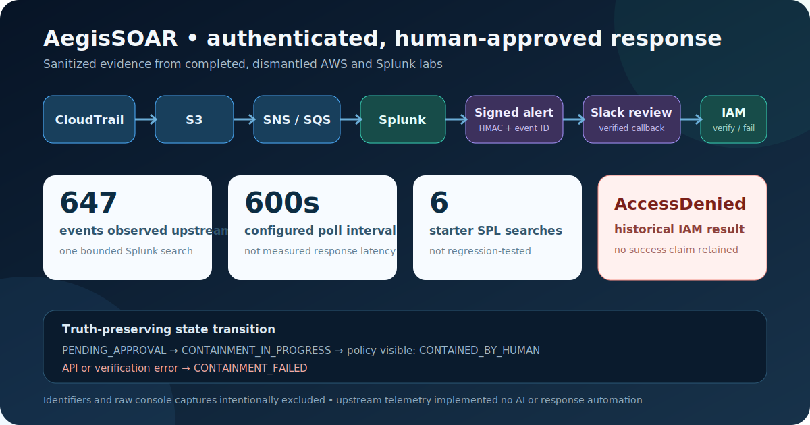
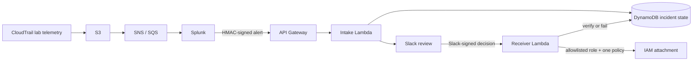

# AegisSOAR: Truth-Preserving Cloud Response Lab

[](https://github.com/PeteAndrews1289/aws-automated-soar-playbook/actions/workflows/validate.yml)



AegisSOAR is a decommissioned, human-in-the-loop AWS security-response lab. Its reference implementation accepts an authenticated alert, persists an allowlisted IAM role with the incident, asks an analyst for a Slack decision, and records containment only after the approved quarantine-policy attachment is visible through IAM.

The most important result was a failed containment attempt. Historical CloudWatch evidence showed `AttachRolePolicy` returning `AccessDenied`, while the early Slack UI said the action had executed. This repository treats that mismatch as a negative test result: the revised workflow records `CONTAINMENT_FAILED` and never reports a contained state after an API error or failed verification.

> **Status:** completed and dismantled. Terraform and Python are a reviewable reference implementation; they have not been redeployed or used to retroactively claim a successful containment run.

## What this case study demonstrates

- HMAC-authenticated alert intake with a five-minute replay window.
- Slack signing-secret verification using the exact raw request body and timestamp.
- Idempotent alert creation and conditional incident-state transitions in DynamoDB.
- An analyst decision boundary before a disruptive IAM action.
- A target role captured at intake, checked against an allowlist, persisted, retrieved, and checked again before use.
- Separate Lambda roles for intake and containment; only the receiver can attach one generated quarantine policy to explicitly allowlisted lab roles.
- Verification with `ListAttachedRolePolicies` before the state becomes `CONTAINED_BY_HUMAN`.
- Explicit failure evidence: error type, state, and timestamp without falsely claiming containment.
- Optional model-assisted triage text with deterministic fallback and no authority over response actions.
- Unit and workflow tests plus pinned CI and Terraform validation.

## Architecture



The CloudTrail-to-Splunk path is upstream context consolidated from a separate completed lab. It was manually configured and later dismantled; it did **not** implement AI triage or automated response. The SOAR code starts at the signed alert boundary.

## Incident state model

| State | Meaning |
| --- | --- |
| `ALERT_RECEIVED` | Authenticated, unique alert stored; notification not yet confirmed. |
| `PENDING_APPROVAL` | Slack notification succeeded and an analyst decision is expected. |
| `NOTIFICATION_FAILED` | Slack delivery failed; the incident is not presented as awaiting approval. |
| `CONTAINMENT_IN_PROGRESS` | One approval won the conditional transition and IAM work began. |
| `CONTAINED_BY_HUMAN` | The allowlisted policy attachment was visible after the API call. |
| `CONTAINMENT_FAILED` | The IAM call failed, the role was invalid, or attachment verification failed. |
| `FALSE_POSITIVE` | An analyst closed the alert without invoking IAM. |

Repeated alert IDs return the stored state without sending another Slack message. Repeated or concurrent Slack actions cannot invoke containment after the incident leaves `PENDING_APPROVAL`.

## Authentication contracts

### Alert sender

The sender supplies `X-Aegis-Timestamp` and `X-Aegis-Signature`. The signature is:

```text
v1=hex(HMAC-SHA256(secret, "v1:" + unix_timestamp + ":" + exact_request_body))
```

The body must include a stable, unique `event_id`; it is the DynamoDB idempotency key.

```json
{
  "event_id": "splunk-result-2026-05-26T151834Z-001",
  "search_name": "Suspicious IAM policy change",
  "result": {
    "clientip": "192.0.2.44",
    "host": "lab-workload",
    "iam_role": "aegis-response-target"
  }
}
```

### Slack

The public Function URL verifies Slack's `v0` signature over the raw form body and rejects timestamps outside the five-minute window. The signing secret is read from Secrets Manager. Returning a replacement message directly avoids trusting a callback URL from the payload.

## Least-privilege boundary

The Terraform configuration creates two execution roles:

- **Intake:** can read only its configured secrets and put/get/update the incident table. It has no IAM containment permission.
- **Receiver:** can read only the Slack signing secret, get/update incidents, attach only the generated quarantine policy to the configured role ARNs, and list policies for those same roles.

The application independently checks `ALLOWED_TARGET_ROLES` at alert intake and again after loading the incident. Secrets are referenced by ARN, not committed or passed as plaintext Terraform variables.

## Validation

```bash
python -m unittest discover -s tests -v
python scripts/validate_repository.py
terraform -chdir=terraform fmt -check -recursive
terraform -chdir=terraform init -backend=false -input=false -lockfile=readonly
terraform -chdir=terraform validate
```

CI runs the same checks with commit-pinned GitHub Actions.

## Deployment outline

1. Create three Secrets Manager values: an alert HMAC secret, a Slack incoming-webhook URL, and the Slack app signing secret.
2. Create or identify a disposable target role in the same AWS account.
3. Copy `terraform/terraform.tfvars.example` to an ignored `terraform.tfvars` and replace the placeholders with secret ARNs and the exact target-role name.
4. Initialize, review `terraform plan`, and apply only in a disposable lab account.
5. Configure Slack interactivity with the sensitive Terraform output and configure the alert sender to sign the exact body.
6. Exercise both failure and success paths, verify DynamoDB and IAM independently, then run `terraform destroy`.

Model-assisted narrative generation is disabled unless both an API-key secret ARN and an explicit, evaluated model ID are configured. The deterministic narrative remains available without an external model.

## Evidence and limitations

- The original IAM attempt failed with `AccessDenied`; there is no claim of historically successful IAM containment.
- The Kubernetes NetworkPolicy is a reviewable sample that was generated. No retained evidence shows it was applied to a cluster or isolated a pod.
- A bounded upstream Splunk search showed **647 CloudTrail events**. This is not a throughput benchmark.
- The upstream SQS input used a **600-second polling interval**. This is configuration evidence, not measured end-to-end latency or a real-time claim.
- **Six starter SPL searches** were written, but no public event corpus remains for regression testing.
- The upstream CloudTrail lab did not implement AI or response automation.
- A visible policy attachment verifies IAM control-plane state only; it does not prove immediate revocation of existing sessions or workload isolation.
- Screenshots containing an AWS account ID, endpoint URL, and contradictory status text were removed from the current tree. They remain recoverable in Git history unless history is rewritten.

See [the evidence register](docs/evidence-register.md), [the incident workflow](docs/incident-workflow.md), [the upstream searches](detections/cloudtrail-starter-searches.md), and [the IAM migration map](detections/iam-investigation-notes.md) for the audit trail and interpretation boundaries. Tested `AWS-IAM-001` and `AWS-ROOT-001` hypotheses now live in the separate [Detection Engineering Lab](https://github.com/PeteAndrews1289/detection-engineering-lab).

## Repository map

```text
lambda_soar/       authenticated intake, Slack receiver, shared security helpers
terraform/         split-role, allowlisted reference infrastructure
tests/             authentication, replay, state, failure, and success-path tests
detections/        upstream searches plus a documented IAM-lab migration map
docs/              state model, evidence register, and sanitized SVG
k8s_quarantine/    generated-only NetworkPolicy example
```

## License

The reference code and documentation are available under the [MIT License](LICENSE).
