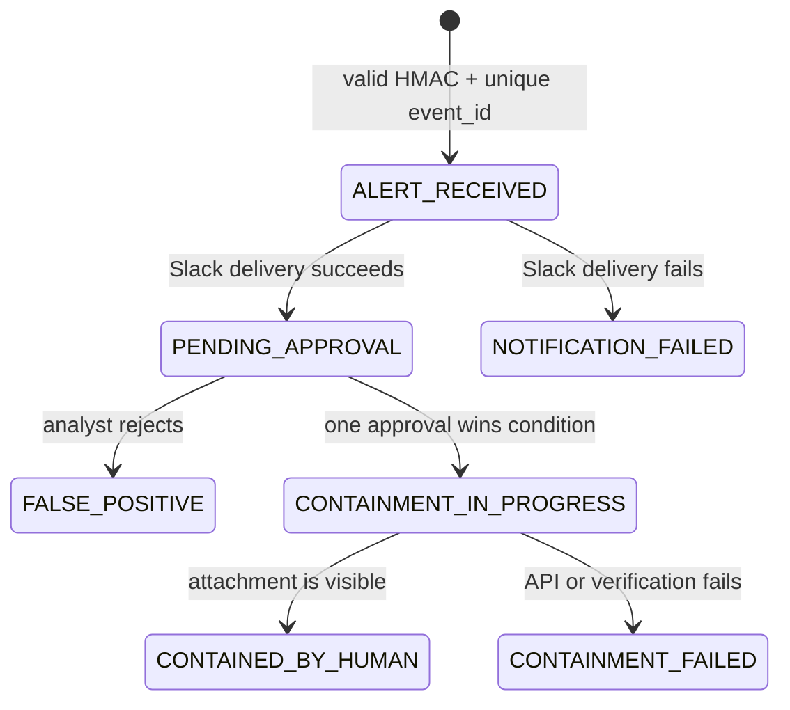

# Incident workflow and invariants

## State sequence

## Safety invariants

1. An unauthenticated or stale request cannot create or change an incident.
2. A repeated `event_id` cannot create another Slack notification.
3. The alert-provided role must be in the deployment allowlist before it is stored.
4. The receiver retrieves the stored role; it does not use a hardcoded role or a new role value from Slack.
5. The stored role is checked against the allowlist again immediately before IAM use.
6. Only one conditional transition can move an incident from `PENDING_APPROVAL` to `CONTAINMENT_IN_PROGRESS` or `FALSE_POSITIVE`.
7. Exceptions from `AttachRolePolicy` are recorded as `CONTAINMENT_FAILED` and are never discarded.
8. `CONTAINED_BY_HUMAN` is written only after `ListAttachedRolePolicies` returns the expected policy ARN.
9. The optional narrative cannot choose an action, target a role, or change state.

## Verification boundary

The success check proves only that IAM listed the generated quarantine policy as attached to the allowlisted role. It does not prove that existing sessions were revoked, that AWS eventual consistency completed everywhere, or that a workload was isolated. Production response would need session revocation, workload-level validation, rollback, alarms for stuck `CONTAINMENT_IN_PROGRESS` records, and an independent reconciliation process.

## Historical negative test

The completed lab retained CloudWatch evidence of an `AccessDenied` response from `AttachRolePolicy`. An early Slack message nevertheless said the action was “approved and executed” because the exception was discarded and the database was unconditionally updated. The revised receiver has a dedicated test for that exact failure mode.
